# EXNO:4-DS
# AIM:
To read the given data and perform Feature Scaling and Feature Selection process and save the
data to a file.

# ALGORITHM:
STEP 1:Read the given Data.

STEP 2:Clean the Data Set using Data Cleaning Process.

STEP 3:Apply Feature Scaling for the feature in the data set.

STEP 4:Apply Feature Selection for the feature in the data set.

STEP 5:Save the data to the file.

# FEATURE SCALING:
1. Standard Scaler: It is also called Z-score normalization. It calculates the z-score of each value and replaces the value with the calculated Z-score. The features are then rescaled with x̄ =0 and σ=1

2. MinMaxScaler: It is also referred to as Normalization. The features are scaled between 0 and 1. Here, the mean value remains same as in Standardization, that is,0.

3. Maximum absolute scaling: Maximum absolute scaling scales the data to its maximum value; that is,it divides every observation by the maximum value of the variable.The result of the preceding transformation is a distribution in which the values vary approximately within the range of -1 to 1.

4. RobustScaler: RobustScaler transforms the feature vector by subtracting the median and then dividing by the interquartile range (75% value — 25% value).

# FEATURE SELECTION:
Feature selection is to find the best set of features that allows one to build useful models. Selecting the best features helps the model to perform well.

The feature selection techniques used are:

1.Filter Method

2.Wrapper Method

3.Embedded Method

# CODING AND OUTPUT:
```
   import pandas as pd

import numpy as np

df=pd.read_csv("D:Bmi.csv")    
```
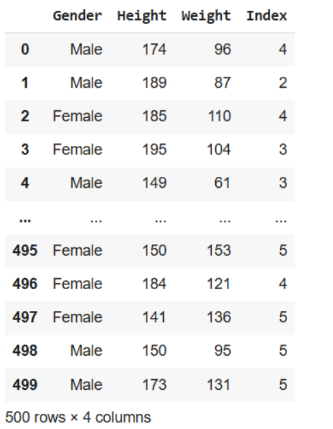


```
df.dropna()
```

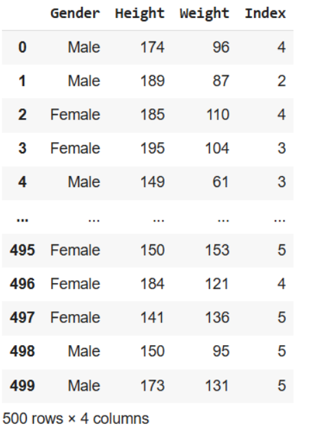


```
max_vals=np.max(np.abs(df[['Height','Weight']]))

max_vals

image
from sklearn.preprocessing import MinMaxScaler

scaler=MinMaxScaler()

df[['Height','Weight']]=scaler.fit_transform(df[['Height','Weight']])

df.head(10)

```

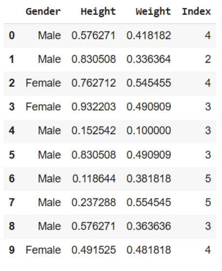

```
df1=pd.read_csv("bmi.csv")

df2=pd.read_csv("bmi.csv")

df3=pd.read_csv("bmi.csv")

df4=pd.read_csv("bmi.csv")

df5=pd.read_csv("bmi.csv")
```
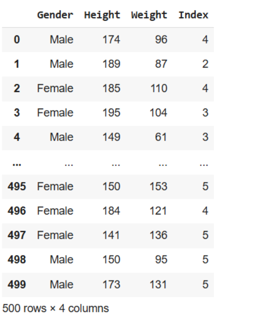

```
from sklearn.preprocessing import StandardScaler

sc=StandardScaler()

df1[['Height','Weight']]=sc.fit_transform(df1[['Height','Weight']])

df.head(10)
```

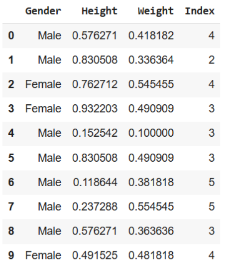

```
from sklearn.preprocessing import Normalizer

scaler=Normalizer()

df2[['Height','Weight']]=scaler.fit_transform(df2[['Height','Weight']])

```

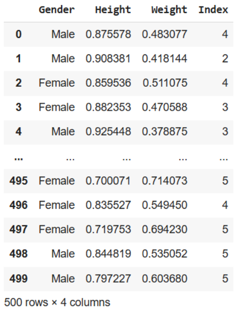

```
from sklearn.preprocessing import MaxAbsScaler

max1=MaxAbsScaler()

df3[['Height','Weight']]=max1.fit_transform(df3[['Height','Weight']])
```


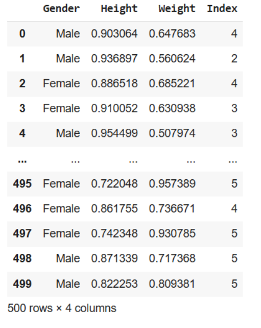


```
from sklearn.preprocessing import RobustScaler

roub=RobustScaler()

df4[['Height','Weight']]=roub.fit_transform(df4[['Height','Weight']])
```

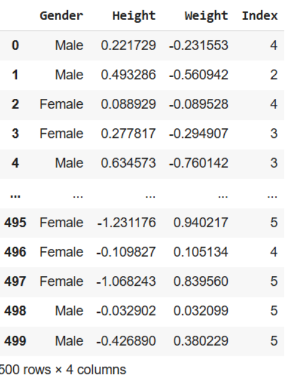

```
from sklearn.feature_selection import SelectKBest,f_regression,mutual_info_classif

from sklearn.feature_selection import chi2

data=pd.read_csv("income(1) (1).csv")
```

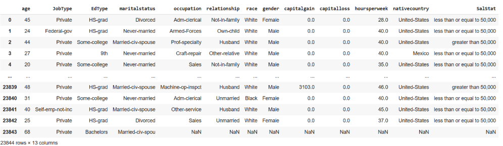

```
data1=pd.read_csv('/content/titanic_dataset (1).csv')
```
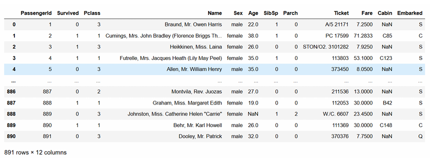

```

data1=data1.dropna()

x=data1.drop(['Survived','Name','Ticket'],axis=1)

y=data1['Survived']

data1['Sex']=data1['Sex'].astype('category')

data1['Cabin']=data1['Cabin'].astype('category')

data1['Embarked']=data1['Embarked'].astype('category')

data1['Sex']=data1['Sex'].cat.codes

data1['Cabin']=data1['Cabin'].cat.codes

data1['Embarked']=data1['Embarked'].cat.codes
```

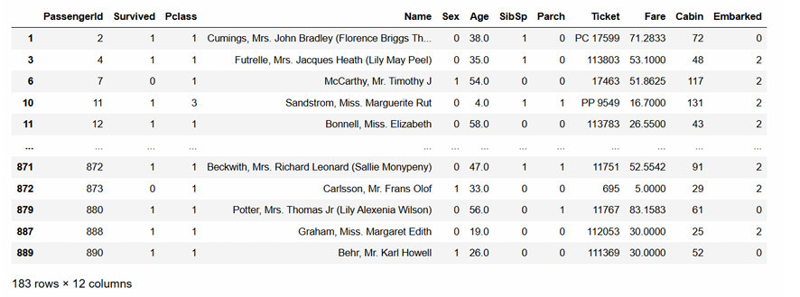

```
k=5

selector=SelectKBest(score_func=chi2,k=k)

x=pd.get_dummies(x)

x_new=selector.fit_transform(x,y)

x_encoded=pd.get_dummies(x)

selector=SelectKBest(score_func=chi2,k=5)

x_new=selector.fit_transform(x_encoded,y)

selected_feature_indices=selector.get_support(indices=True)

selected_features=x.columns[selected_feature_indices]

print("Selected Features:")

print(selected_features)
```

```model=RandomForestClassifier(n_estimators=100,random_state=42)

model.fit(x,y)

feature_importance=model.feature_importances_ threshold=0.15

selected_features=x.columns[feature_importance>threshold]

print("Selected Features:")

print(selected_features)
```
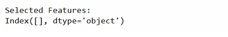


# RESULT:
    Thus the given data and perform Feature Scaling and Feature Selection process and save the data to a file.
